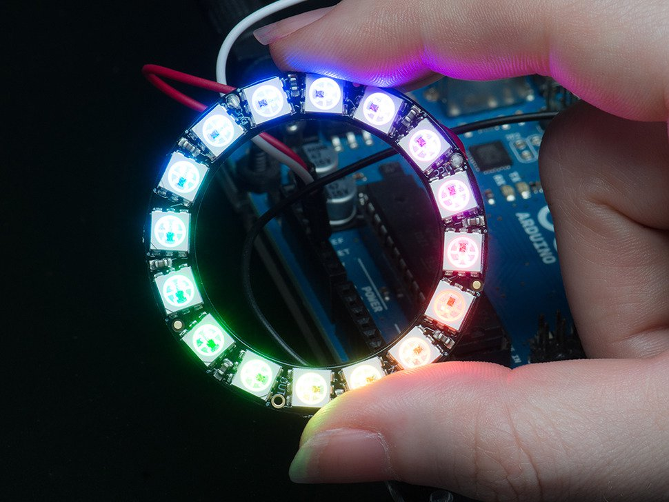

# Introduction

Now that we've gotten to grips with some of the possibilities demonstrated in [The First Session](0-GettingStarted.md), we're going to do a deep dive into the use of the [NeoPixel](https://www.adafruit.com/category/168) range of RGB lights. 

We've already experimented with the [NeoPixel Ring](https://www.adafruit.com/product/1463) in the last session, so we'll start off there again, but from there we're going to extend on from here to strip lights and matrix arrays



## Background / Reminder

Last time we were using the ESP32 microcontroller which had advanced networking capabilities and better sensor processing power. 

This time around we're using the simpler Arudino Uno boards, which are more stable for interfacing with the NeoPixel range with longer/more modules.

We started with the simple code below. It's worth taking some time to re-read the steps of the code and make sure we understand whats going on. Remember that lines that start with `//` are "comments" that the controller ignores and are just for the programmers aid.

```cpp
// NeoPixel Ring simple sketch (c) 2013 Shae Erisson
// Augmented 2019 Andrew Bolster
// Released under the GPLv3 license to match the rest of the
// Adafruit NeoPixel library

#include <Adafruit_NeoPixel.h>
#ifdef __AVR__
 #include <avr/power.h> // Required for 16 MHz Adafruit Trinket
#endif

// Which pin on the Arduino is connected to the NeoPixels?
//#define PIN        6 // On Trinket or Gemma, suggest changing this to 1
//#define PIN 		 25 // Best for the ESP32
#define PIN 			 4 // Best for the Arudino Uno

// How many NeoPixels are attached to the Arduino?
#define NUMPIXELS 16 // Popular NeoPixel ring size

// When setting up the NeoPixel library, we tell it how many pixels,
// and which pin to use to send signals. Note that for older NeoPixel
// strips you might need to change the third parameter -- see the
// strandtest example for more information on possible values.
Adafruit_NeoPixel pixels(NUMPIXELS, PIN, NEO_GRB + NEO_KHZ800);

#define DELAYVAL 500 // Time (in milliseconds) to pause between pixels

// This is run once when the controller starts up
void setup() {
  // These lines are specifically to support the Adafruit Trinket 5V 16 MHz.
  // Any other board, you can remove this part (but no harm leaving it):
#if defined(__AVR_ATtiny85__) && (F_CPU == 16000000)
  clock_prescale_set(clock_div_1);
#endif
  // END of Trinket-specific code.

  pixels.begin(); // INITIALIZE NeoPixel strip object (REQUIRED)
}

// This section is run repeatedly forever after setup() has completed
void loop() {
  pixels.clear(); // Set all pixel colors to 'off'

  // The first NeoPixel in a strand is #0, second is 1, all the way up
  // to the count of pixels minus one.
  for(int i=0; i<NUMPIXELS; i++) { // For each pixel...

    // pixels.Color() takes RGB values, from 0,0,0 up to 255,255,255
    // Here we're using a moderately bright green color:
    pixels.setPixelColor(i, pixels.Color(0, 150, 0));

    pixels.show();   // Send the updated pixel colors to the hardware.

    delay(DELAYVAL); // Pause before next pass through loop
  }
}
```


# Challenges

All of these challenges have 'solutions' provided for them, but remember, there is more than one way to do things, and you should *not* check out the solutions until you've attempted the challenges yourself. And as always, Google is your friend!

There are also optional unsolved 'Extensions' to challenges that might be interesting additions to existing challenges for you to explore

Also feel free to explore your own 'extensions' to challenges and let Andrew know and he can add them to the next class!

## SimpleSingle: "Simple" Ring with one light at a time

Starting off with the `simple` example, either based on the above code or from the **Examples > Adafruit Neopixels > Simple** sketch, instead of the lights "growing" around the ring, make them go one at a time. 

<details>
	<summary>Solution</summary>
	<p>
	
```cpp
// This section is run repeatedly forever after setup() has completed
void loop() {
  pixels.clear(); // Set all pixel colors to 'off'

  // The first NeoPixel in a strand is #0, second is 1, all the way up
  // to the count of pixels minus one.
  for(int i=0; i<NUMPIXELS; i++) { // For each pixel...

    // pixels.Color() takes RGB values, from 0,0,0 up to 255,255,255
    // Here we're using a moderately bright green color:
    pixels.setPixelColor(i, pixels.Color(0, 150, 0));

    pixels.show();   // Send the updated pixel colors to the hardware.

    delay(DELAYVAL); // Pause before next pass through loop
    
    pixels.setPixelColor(i, pixels.Color(0, 150, 0)); // Turn this light off 
    // (this won't be applied to the strip until `pixels.show()` is called in the next loop
  }
}
```
	</p>
	
</details>

## SimpleStrip/SimpleSingleStrip: "Simple" with the NeoPixel Strip

What do you have to change to adapt the original "simple" code (or indeed, your solution to the "Simple Single") to use the full length of the strip.

<details>
	<summary>Hint</summary>
	<p>The NeoPixel Strip has 60 LED's and the NeoMatrix has 64 LEDs</p>
</details>
<details>
	<summary>Solution</summary>
	<p>
	Update the `#define NUMPIXELS` value defined at near the top of the sketch to _60_ for the pixel strip
	</p>
</details>

## Random: 

Turn random LED's on and off

<details>
	<summary>Solution</summary>
	<p>
	
Sometimes it's better to keep things simple!

```cpp
void loop() {
    pixels.clear();
    // pixels.Color() takes RGB values, from 0,0,0 up to 255,255,255
    // Here we're using a moderately bright green color:
    pixels.setPixelColor(random(NUMPIXELS), pixels.Color(0, 150, 0));
    pixels.show();   // Send the updated pixel colors to the hardware.

    delay(DELAYVAL); // Pause before next pass through loop
}
```

	</p>
</details>

### Extension: Random with Random Colours

### Extension: Random Fill

## Even/Odd

All at once, turn every other LED (0,2,4,6,8, etc) on and off, then turn the alternate (1,3,5,7,etc) on and off, and repeat

<details>
	<summary>Solution</summary>
	<p>
	
Above the `setup()` function add

```cpp
#define SKIP 2 // Width of Skip (we jump every other LED)
```

and then update the `loop` with

```cpp
void loop() {
  // The first NeoPixel in a strand is #0, second is 1, all the way up
  // to the count of pixels minus one.
  for(int i=0; i<SKIP; i++) { // For each 'SKIP' start (0,1,etc)
    
    pixels.clear(); // Set all pixel colors to 'off'
    
    for( int j=i; j<NUMPIXELS; j+=SKIP){ // (Start from the i, and 
                                  // skip over until the end of the strip

      // pixels.Color() takes RGB values, from 0,0,0 up to 255,255,255
      // Here we're using a moderately bright green color:
      pixels.setPixelColor(j, pixels.Color(0, 150, 0));
    }
     
    pixels.show();   // Send the updated pixel colors to the hardware.

    delay(DELAYVAL); // Pause before next pass through loop
  }
}
```

	</p>
</details>

### Extension: Alternate Colours

One colour for evens, one colour for odds

### Extension: Random Colours

Random colour for each loop

### Extension: Every N

Could you extend this to skip in 3's instead of 2's? What about 5's?

## Line Chase

When we did "Simple Single", we had one LED 'moving' up the strip. How could we change this to being 5 LED's moving across the strip (or any number of LEDs) moving as a block.

<details>
	<summary>Solution</summary>
	<p>
Above the `setup()` function add

```cpp
#define CHASE 5 // How long a block of active LEDs we have
```

and then update the `loop` with
	
```cpp
void loop() {
  pixels.clear(); // Set all pixel colors to 'off'

  // The first NeoPixel in a strand is #0, second is 1, all the way up
  // to the count of pixels minus one.
  for(int i=0; i<NUMPIXELS; i++) { // For each pixel...

    // pixels.Color() takes RGB values, from 0,0,0 up to 255,255,255
    // Here we're using a moderately bright green color:
    pixels.setPixelColor(i, pixels.Color(0, 150, 0));

    pixels.show();   // Send the updated pixel colors to the hardware.

    delay(DELAYVAL); // Pause before next pass through loop

    // turn off the LED 'CHASE' elements behind me
    if (i>CHASE){
      pixels.setPixelColor(i-CHASE, pixels.Color(0, 0, 0));
    }
  }
}
```

	</p>
</details>

### Extension: Looping Line

When the "block" gets to the end of the strip, make it continue "around" the strip as if the strip was in a ring, so there are always 5 LED's active.

### Extension: Bouncing Line

When the "block" gets to the end of the strip, make it "bounce back" and come backwards down the line instead of looping "around" the strip

## Rainbow

## Rolling Rainbow


