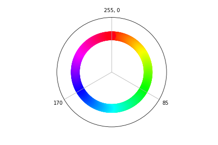

# Introduction

Now that we've gotten to grips with some of the possibilities demonstrated in [The First Session](0-GettingStarted.md), we're going to do a deep dive into the use of the [NeoPixel](https://www.adafruit.com/category/168) range of RGB lights. 

We've already experimented with the [NeoPixel Ring](https://www.adafruit.com/product/1463) in the last session, so we'll start off there again, but from there we're going to extend on from here to strip lights and matrix arrays


## Background / Reminder

Last time we were using the ESP32 microcontroller which had advanced networking capabilities and better sensor processing power. 

This time around we're using the simpler Arudino Uno boards, which are more stable for interfacing with the NeoPixel range with longer/more modules.

We started with the simple code below. It's worth taking some time to re-read the steps of the code and make sure we understand whats going on. Remember that lines that start with `//` are "comments" that the controller ignores and are just for the programmers aid.

```cpp
// NeoPixel Ring simple sketch (c) 2013 Shae Erisson
// Augmented 2019 Andrew Bolster
// Released under the GPLv3 license to match the rest of the
// Adafruit NeoPixel library

#include <Adafruit_NeoPixel.h>
#ifdef __AVR__
 #include <avr/power.h> // Required for 16 MHz Adafruit Trinket
#endif

// Which pin on the Arduino is connected to the NeoPixels?
//#define PIN        6 // On Trinket or Gemma, suggest changing this to 1
//#define PIN 		 25 // Best for the ESP32
#define PIN 			 4 // Best for the Arudino Uno

// How many NeoPixels are attached to the Arduino?
#define NUMPIXELS 16 // Popular NeoPixel ring size

// When setting up the NeoPixel library, we tell it how many pixels,
// and which pin to use to send signals. Note that for older NeoPixel
// strips you might need to change the third parameter -- see the
// strandtest example for more information on possible values.
Adafruit_NeoPixel pixels(NUMPIXELS, PIN, NEO_GRB + NEO_KHZ800);

#define DELAYVAL 500 // Time (in milliseconds) to pause between pixels

// This is run once when the controller starts up
void setup() {
  // These lines are specifically to support the Adafruit Trinket 5V 16 MHz.
  // Any other board, you can remove this part (but no harm leaving it):
#if defined(__AVR_ATtiny85__) && (F_CPU == 16000000)
  clock_prescale_set(clock_div_1);
#endif
  // END of Trinket-specific code.

  pixels.begin(); // INITIALIZE NeoPixel strip object (REQUIRED)
}

// This section is run repeatedly forever after setup() has completed
void loop() {
  pixels.clear(); // Set all pixel colors to 'off'

  // The first NeoPixel in a strand is #0, second is 1, all the way up
  // to the count of pixels minus one.
  for(int i=0; i<NUMPIXELS; i++) { // For each pixel...

    // pixels.Color() takes RGB values, from 0,0,0 up to 255,255,255
    // Here we're using a moderately bright green color:
    pixels.setPixelColor(i, pixels.Color(0, 150, 0));

    pixels.show();   // Send the updated pixel colors to the hardware.

    delay(DELAYVAL); // Pause before next pass through loop
  }
}
```

## Rings, Strips and Matrixes

Fundamentally there is no difference between the Rings, Strips and Matrixes other than the number of and physical layout of LED modules.

In all cases, NeoPixel kits can be "Daisy Chained", so if you have two strips of 60 LED's each and you connect them together, you can address pixels from 0-120.

They are all numbered from 0-N, which makes sense for the Rings and the Strips, but for the Matrix, the layout is a bit more subtle, but might give you some inspiration for where to take your projects next!


The red circles module is the `0` module, the 'top right' module is number `7`, and the first module on the left of the second row is module `8`. This is much the same as how CRT's build up an image on their displays, and how LED/LCD monitors store their state in memory (as 'one' long line that we know the 'width' of)


# Ring/Strip Challenges

All of these challenges have 'solutions' provided for them, but remember, there is more than one way to do things, and you should *not* check out the solutions until you've attempted the challenges yourself. And as always, Google is your friend!

There are also optional unsolved 'Extensions' to challenges that might be interesting additions to existing challenges for you to explore

Also feel free to explore your own 'extensions' to challenges and let Andrew know and he can add them to the next class!

These challenges can be done using any of the Pixel Rings, Strips or Matrixes.


## SimpleSingle: "Simple" Ring with one light at a time

Starting off with the `simple` example, either based on the above code or from the **Examples > Adafruit Neopixels > Simple** sketch, instead of the lights "growing" around the ring, make them go one at a time. 

<details>
	<summary>Solution</summary>
	
```cpp
// This section is run repeatedly forever after setup() has completed
void loop() {
  pixels.clear(); // Set all pixel colors to 'off'

  // The first NeoPixel in a strand is #0, second is 1, all the way up
  // to the count of pixels minus one.
  for(int i=0; i<NUMPIXELS; i++) { // For each pixel...

    // pixels.Color() takes RGB values, from 0,0,0 up to 255,255,255
    // Here we're using a moderately bright green color:
    pixels.setPixelColor(i, pixels.Color(0, 150, 0));

    pixels.show();   // Send the updated pixel colors to the hardware.

    delay(DELAYVAL); // Pause before next pass through loop
    
    pixels.setPixelColor(i, pixels.Color(0, 0, 0)); // Turn this light off 
    // (this won't be applied to the strip until `pixels.show()` is called in the next loop
  }
}
```
	
</details>

## SimpleStrip/SimpleSingleStrip: "Simple" with the NeoPixel Strip

What do you have to change to adapt the original "simple" code (or indeed, your solution to the "Simple Single") to use the full length of the strip.

<details>
	<summary>Hint</summary>
	
The NeoPixel Strip has 60 LED's and the NeoMatrix has 64 LEDs

</details>

<details>
	<summary>Solution</summary>
	
Update the `#define NUMPIXELS` value defined at near the top of the sketch to _60_ for the pixel strip
	
</details>

## Random: 

Turn random LED's on and off

<details>
	<summary>Solution</summary>
	
Sometimes it's better to keep things simple!

```cpp
void loop() {
    pixels.clear();
    // pixels.Color() takes RGB values, from 0,0,0 up to 255,255,255
    // Here we're using a moderately bright green color:
    pixels.setPixelColor(random(NUMPIXELS), pixels.Color(0, 150, 0));
    pixels.show();   // Send the updated pixel colors to the hardware.

    delay(DELAYVAL); // Pause before next pass through loop
}
```

</details>

### Extension: Random with Random Colours

<details>
	<summary>Hint</summary>

Arduino has a built in `random(N)` function where `N` is the maximum possible number, so `random(10)` will return random numbers between 0-10

</details>


### Extension: Random Fill

Instead of "clearing" the `pixels` on each random LED activation, allow the selection of random LED's on the strip (with random colours too if you like!) until the strip is filled, and then clear it and start again.

How do you keep track of what Pixels are on and off? How do you know they're all off? It's not very efficient to randomly pick as you'll regularly pick LED's that are already on. 

Now, that effect is pretty cool on it's own, but try to work out a way to rapidly 'guess' random pixels, check if they're on or not, and if they're already on, move on to the next one.

<details>
	<summary>Hint</summary>

`pixels.getPixelColor(i)`

</details>


## Even/Odd

All at once, turn every other LED (0,2,4,6,8, etc) on and off, then turn the alternate (1,3,5,7,etc) on and off, and repeat

<details>
	<summary>Solution</summary>
	
Above the `setup()` function add

```cpp
#define SKIP 2 // Width of Skip (we jump every other LED)
```

and then update the `loop` with

```cpp
void loop() {
  // The first NeoPixel in a strand is #0, second is 1, all the way up
  // to the count of pixels minus one.
  for(int i=0; i<SKIP; i++) { // For each 'SKIP' start (0,1,etc)
    
    pixels.clear(); // Set all pixel colors to 'off'
    
    for( int j=i; j<NUMPIXELS; j+=SKIP){ // (Start from the i, and 
                                  // skip over until the end of the strip

      // pixels.Color() takes RGB values, from 0,0,0 up to 255,255,255
      // Here we're using a moderately bright green color:
      pixels.setPixelColor(j, pixels.Color(0, 150, 0));
    }
     
    pixels.show();   // Send the updated pixel colors to the hardware.

    delay(DELAYVAL); // Pause before next pass through loop
  }
}
```

</details>

### Extension: Alternate Colours

One colour for evens, one colour for odds

### Extension: Random Colours

Random colour for each loop

### Extension: Every N

Could you extend this to skip in 3's instead of 2's? What about 5's?

## Line Chase

When we did "Simple Single", we had one LED 'moving' up the strip. How could we change this to being 5 LED's moving across the strip (or any number of LEDs) moving as a block.

<details>
	<summary>Solution</summary>

Above the `setup()` function add

```cpp
#define CHASE 5 // How long a block of active LEDs we have
```

and then update the `loop` with
	
```cpp
void loop() {
  pixels.clear(); // Set all pixel colors to 'off'

  // The first NeoPixel in a strand is #0, second is 1, all the way up
  // to the count of pixels minus one.
  for(int i=0; i<NUMPIXELS; i++) { // For each pixel...

    // pixels.Color() takes RGB values, from 0,0,0 up to 255,255,255
    // Here we're using a moderately bright green color:
    pixels.setPixelColor(i, pixels.Color(0, 150, 0));

    pixels.show();   // Send the updated pixel colors to the hardware.

    delay(DELAYVAL); // Pause before next pass through loop

    // turn off the LED 'CHASE' elements behind me
    if (i>(CHASE-1)){
      pixels.setPixelColor(i-(CHASE-1), pixels.Color(0, 0, 0));
    }
  }
}
```

Why is this using `(CHASE-1)` instead of just `CHASE`?

</details>

### Extension: Read The Docs

Look for the documentation for the Adafruit NeoPixel library and see if there is a better way to accomplish this.

<details>
	<summary>Hint</summary>
	
`fill()`
	
</details>

### Extension: Looping Line

When the "block" gets to the end of the strip, make it continue "around" the strip as if the strip was in a ring, so there are always 5 LED's active.

<details>
	<summary>Hint</summary>
	
=59)

=0)

=1)

[Extra Link](https://www.arduino.cc/reference/en/language/structure/arithmetic-operators/modulo/)

</details>

### Extension: Bouncing Line

When the "block" gets to the end of the strip, make it "bounce back" and come backwards down the line instead of just looping "around" the strip

<details>
	<summary>Hint</summary>

What goes `i++`, must go `i--`

</details>

## Rainbow

Given that we know that our `pixels.Color(red,green,blue)` function lets us create specific colours for pixels, how can we generate a smooth 'rainbow' of colours, 

<details>
	<summary>Hint</summary>


</details>

<details>
	<summary>Solution</summary>
	
This time it makes more sense to break things out into "functions" rather than having it all in one `loop()`

A few things to note:

* `uint32_t` means "unsigned 32-bit integer" so it can store values from 0-4294967295. This might seem like a random number but it might be more familiar in it's hexadecimal form; 0xFFFFFFFF. This is enough room to store RGBA (Red, Green, Blue, Alpha) values in one "number" to save space, and is the same thing that has been "returned" by our previous calls to `pixels.Color()`
* 0-255 is a range of values that can be stored in 8-bits cleanly. We could use "0-360" or "0-100" however this would produce edge cases related to decimal places that would be very very messy...
* There is a built in arduino function called `map` that translates from one range to an other; i.e. we have 60 pixels on the strip, and our `ColourWheel` function goes from 0-255, so we need to convert our "pixel id" into the relevant "colour id" 

```cpp

// Input a value 0 to 255 to get a color value.
// The colours are a transition r - g - b - back to r.
uint32_t ColourWheel(byte WheelPos) {
  if(WheelPos < 85) {		//first 1/3rd of a colourwheel (Red to Green)
    return pixels.Color(
    	WheelPos * 3, 
    	255 - WheelPos * 3, 
    	0
    );
  } 
  else if(WheelPos < 170) {//middle 1/3rd of a colourwheel (Green to Blue)
    WheelPos -= 85;
    return pixels.Color(
    	255 - WheelPos * 3, 
    	0, 
    	WheelPos * 3
    );
  } 
  else {						//last 1/3rd of a colourwheel (Blue to Red)
    WheelPos -= 170;
    return pixels.Color(
    	0, 
    	WheelPos * 3, 
    	255 - WheelPos * 3
    );
  }
}

// Generate a rainbow across the array
void loop() {
	for(int i=0; i<pixels.numPixels(); i++) {
	  strip.setPixelColor(i, 
	  	ColourWheel(
	  		map(i,
	  			 0,pixels.numPixels(),
	  			 0,255
	  		)
	  	);
	}
	pixels.show();
	delay(100)
}

```

</details>

## Rolling Rainbow

How can you adapt the Rainbow to that it continuously 'slides' across the strip?

<details>
	<summary>Hint</summary>
	
This is similar to the solution form the 'Extension: Looping Line' hint...

</details>
	
<details>
	<summary>Solution</summary>
	
```cpp
void rainbow(uint8_t wait) {
  for(int j=0; j<256; j++) {
    for(int i=0; i<pixels.numPixels(); i++) {
	  pixels.setPixelColor((i+j) % pixels.numPixels(), 
	  	ColourWheel(
	  		map(i,
	  			 0,pixels.numPixels(),
	  			 0,255
	  		)
	  	);
    }
    pixels.show();
    delay(wait);
  }
}

void loop() {
   rainbow(10);
   delay(10);
}
```

</details>

# Matrix Challenges

When moving on to the Matrix challenges, these are best accomplished in teams of three, as the experimentation is a bit more involved (and we have fewer Matrix displays than Strips as they're more expensive...)

**Be very careful about the wiring of the matrix displays as they are different than the strips; Check with Andrew before powering anything on!**

Remember the Layout of LED's in the Matrix

<table border="1" class="dataframe">
  <thead>
    <tr style="text-align: right;">
      <th>Row/Col</th>
      <th>0</th>
      <th>1</th>
      <th>2</th>
      <th>3</th>
      <th>4</th>
      <th>5</th>
      <th>6</th>
      <th>7</th>
    </tr>
  </thead>
  <tbody>
    <tr>
      <th>0</th>
      <td>0</td>
      <td>1</td>
      <td>2</td>
      <td>3</td>
      <td>4</td>
      <td>5</td>
      <td>6</td>
      <td>7</td>
    </tr>
    <tr>
      <th>1</th>
      <td>8</td>
      <td>9</td>
      <td>10</td>
      <td>11</td>
      <td>12</td>
      <td>13</td>
      <td>14</td>
      <td>15</td>
    </tr>
    <tr>
      <th>2</th>
      <td>16</td>
      <td>17</td>
      <td>18</td>
      <td>19</td>
      <td>20</td>
      <td>21</td>
      <td>22</td>
      <td>23</td>
    </tr>
    <tr>
      <th>3</th>
      <td>24</td>
      <td>25</td>
      <td>26</td>
      <td>27</td>
      <td>28</td>
      <td>29</td>
      <td>30</td>
      <td>31</td>
    </tr>
    <tr>
      <th>4</th>
      <td>32</td>
      <td>33</td>
      <td>34</td>
      <td>35</td>
      <td>36</td>
      <td>37</td>
      <td>38</td>
      <td>39</td>
    </tr>
    <tr>
      <th>5</th>
      <td>40</td>
      <td>41</td>
      <td>42</td>
      <td>43</td>
      <td>44</td>
      <td>45</td>
      <td>46</td>
      <td>47</td>
    </tr>
    <tr>
      <th>6</th>
      <td>48</td>
      <td>49</td>
      <td>50</td>
      <td>51</td>
      <td>52</td>
      <td>53</td>
      <td>54</td>
      <td>55</td>
    </tr>
    <tr>
      <th>7</th>
      <td>56</td>
      <td>57</td>
      <td>58</td>
      <td>59</td>
      <td>60</td>
      <td>61</td>
      <td>62</td>
      <td>63</td>
    </tr>
  </tbody>
</table>

## Spiral

Starting from the `0`th pixel moving clockwise, draw a spiral

(This is hard... If you're getting tight for time, skip this one)

<details>
	<summary>Solution</summary>

```cpp

#define SIDE 8

void spiral(int top_left, int bottom_right, int side, uint32_t color, int d){
  if (side>0){
    // Go around the 'outside' of this square
    for (int i=top_left; i<(top_left+side)-1; i++){
      pixels.setPixelColor(i, color);
      pixels.show();
      delay(d);
    }
    for (int i=(top_left+side)-1; i<bottom_right; i+=SIDE){
      pixels.setPixelColor(i, color);
      pixels.show();
      delay(d);
    }
    for (int i=bottom_right; i>(bottom_right-side+1); i--){
      pixels.setPixelColor(i, color);
      pixels.show();
      delay(d);
    }
    for (int i=(bottom_right-side+1); i>top_left; i-=SIDE){
      pixels.setPixelColor(i, color);
      pixels.show();
      delay(d);
    }
    spiral(top_left+SIDE+1, bottom_right-SIDE-1, side-2, color, d);
  }
}

void loop() {
  pixels.clear(); // Set all pixel colors to 'off'

  // To draw a spiral, we go 
  spiral(0,63,8,pixels.Color(0,5,0),10);
  delay(500);
}
```
</details>

### Extension: Rainbow Spiral

<details>
	<summary>Hint</summary>
See if you can steal a function from previous rainbows and reuse it instead of building a new one from scratch
</details>

<details>
	<summary>Solution</summary>
	
```cpp

#define SIDE 8

// Input a value 0 to 255 to get a color value.
// The colours are a transition r - g - b - back to r.
uint32_t ColourWheel(byte WheelPos) {
  if(WheelPos < 85) {    //first 1/3rd of a colourwheel (Red to Green)
    return pixels.Color(
      WheelPos * 3, 
      255 - WheelPos * 3, 
      0
    );
  } 
  else if(WheelPos < 170) {//middle 1/3rd of a colourwheel (Green to Blue)
    WheelPos -= 85;
    return pixels.Color(
      255 - WheelPos * 3, 
      0, 
      WheelPos * 3
    );
  } 
  else {            //last 1/3rd of a colourwheel (Blue to Red)
    WheelPos -= 170;
    return pixels.Color(
      0, 
      WheelPos * 3, 
      255 - WheelPos * 3
    );
  }
}

void spiral(int top_left, int bottom_right, int side, int d){
  // At each start; we have done SIDE-side loops
  int path_distance = 0;
  for (int i=SIDE-1; i>side;i-=2){
    path_distance+=i;
  }
  path_distance *=4;
  
  if (side>0){
    // Go around the 'outside' of this square
    for (int i=top_left; i<(top_left+side)-1; i++){
      pixels.setPixelColor(i, 
        ColourWheel(map(path_distance, 0,SIDE*SIDE,0,255))
      );
      path_distance+=1;
      pixels.show();
      delay(d);
    }
    for (int i=(top_left+side)-1; i<bottom_right; i+=SIDE){
      pixels.setPixelColor(i, 
        ColourWheel(map(path_distance, 0,SIDE*SIDE,0,255))
      );
      path_distance+=1;
      pixels.show();
      delay(d);
    }
    for (int i=bottom_right; i>(bottom_right-side+1); i--){
      pixels.setPixelColor(i, 
        ColourWheel(map(path_distance, 0,SIDE*SIDE,0,255))
      );
      path_distance+=1;
      pixels.show();
      delay(d);
    }
    for (int i=(bottom_right-side+1); i>top_left; i-=SIDE){
       pixels.setPixelColor(i, 
        ColourWheel(map(path_distance, 0,SIDE*SIDE,0,255))
      );
      path_distance+=1;
      pixels.show();
      delay(d);
    }
    spiral(top_left+SIDE+1, bottom_right-SIDE-1, side-2, d);
  }
}

void loop() {
  pixels.clear(); // Set all pixel colors to 'off'

  // To draw a spiral, we go 
  spiral(0,63,8,10);
  delay(500);
}
```

</details>

## Text Scrolling
Using **Tools>Manage Libraries**, add the `Adafruit NeoMatrix` library

Using the online documentation, work out a sketch for how to use it to make it scroll the text "FutureLabs" across the display.

<details>
	<summary>Hint</summary>

The NeoMatrix Library has some more examples that you might be able to use as the basis for this challenge... But it needs several tweaks!

</details>

<details>
	<summary>Solution</summary>
This is a solution based off the `matrixtest` example shown for completeness.

```cpp
// Adafruit_NeoMatrix example for single NeoPixel Shield.
// Scrolls 'Howdy' across the matrix in a portrait (vertical) orientation.

#include <Adafruit_GFX.h>
#include <Adafruit_NeoMatrix.h>
#include <Adafruit_NeoPixel.h>
#ifndef PSTR
 #define PSTR // Make Arduino Due happy
#endif

#define PIN 3

// MATRIX DECLARATION:
// Parameter 1 = width of NeoPixel matrix
// Parameter 2 = height of matrix
// Parameter 3 = pin number (most are valid)
// Parameter 4 = matrix layout flags, add together as needed:
//   NEO_MATRIX_TOP, NEO_MATRIX_BOTTOM, NEO_MATRIX_LEFT, NEO_MATRIX_RIGHT:
//     Position of the FIRST LED in the matrix; pick two, e.g.
//     NEO_MATRIX_TOP + NEO_MATRIX_LEFT for the top-left corner.
//   NEO_MATRIX_ROWS, NEO_MATRIX_COLUMNS: LEDs are arranged in horizontal
//     rows or in vertical columns, respectively; pick one or the other.
//   NEO_MATRIX_PROGRESSIVE, NEO_MATRIX_ZIGZAG: all rows/columns proceed
//     in the same order, or alternate lines reverse direction; pick one.
//   See example below for these values in action.
// Parameter 5 = pixel type flags, add together as needed:
//   NEO_KHZ800  800 KHz bitstream (most NeoPixel products w/WS2812 LEDs)
//   NEO_KHZ400  400 KHz (classic 'v1' (not v2) FLORA pixels, WS2811 drivers)
//   NEO_GRB     Pixels are wired for GRB bitstream (most NeoPixel products)
//   NEO_GRBW    Pixels are wired for GRBW bitstream (RGB+W NeoPixel products)
//   NEO_RGB     Pixels are wired for RGB bitstream (v1 FLORA pixels, not v2)


// Example for NeoPixel Shield.  In this application we'd like to use it
// as a 5x8 tall matrix, with the USB port positioned at the top of the
// Arduino.  When held that way, the first pixel is at the top right, and
// lines are arranged in columns, progressive order.  The shield uses
// 800 KHz (v2) pixels that expect GRB color data.
Adafruit_NeoMatrix matrix = Adafruit_NeoMatrix(8, 8, PIN,
  NEO_MATRIX_TOP     + NEO_MATRIX_LEFT +
  NEO_MATRIX_ROWS + NEO_MATRIX_PROGRESSIVE,
  NEO_GRB            + NEO_KHZ800);

const uint16_t colors[] = {
  matrix.Color(255, 0, 0), matrix.Color(0, 255, 0), matrix.Color(0, 0, 255) };

void setup() {
  matrix.begin();
  matrix.setTextWrap(false);
  matrix.setBrightness(40);
  matrix.setTextColor(colors[0]);
}

int x    = matrix.width();
int pass = 0;

void loop() {
  matrix.fillScreen(0);
  matrix.setCursor(x, 0);
  matrix.print(F("FutureLabs"));
  if(--x < -(matrix.width()*8)) {
    x = matrix.width();
    if(++pass >= 3) pass = 0;
    matrix.setTextColor(colors[pass]);
  }
  matrix.show();
  delay(100);
}
```
</details>


# Wrapup/Free for all

Where do you want to go next? 

Discuss your ideas and explore the possibilities!
